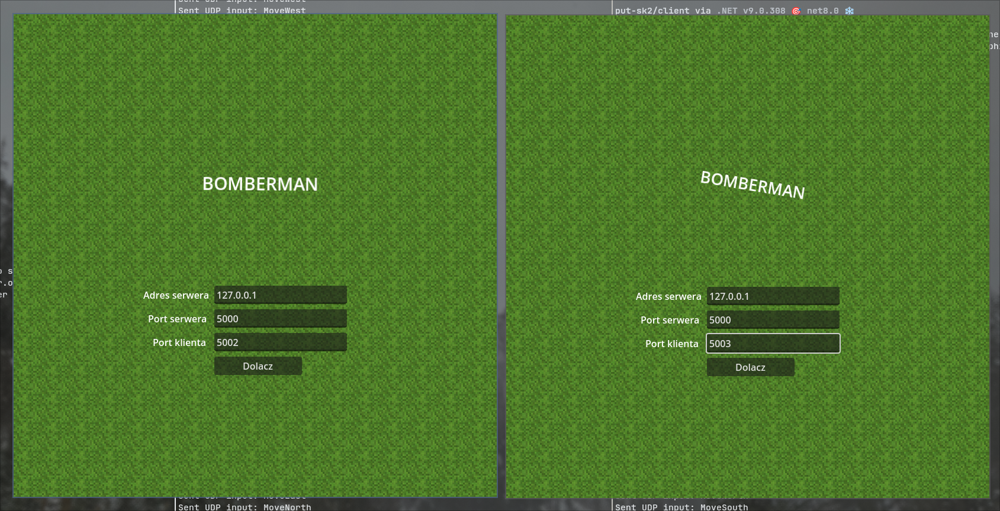
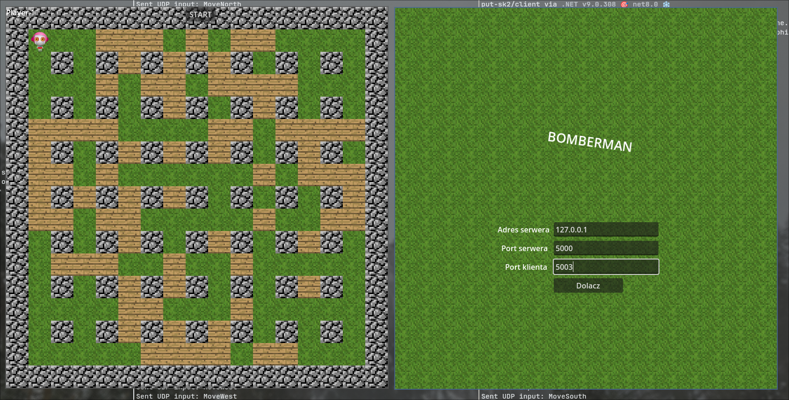
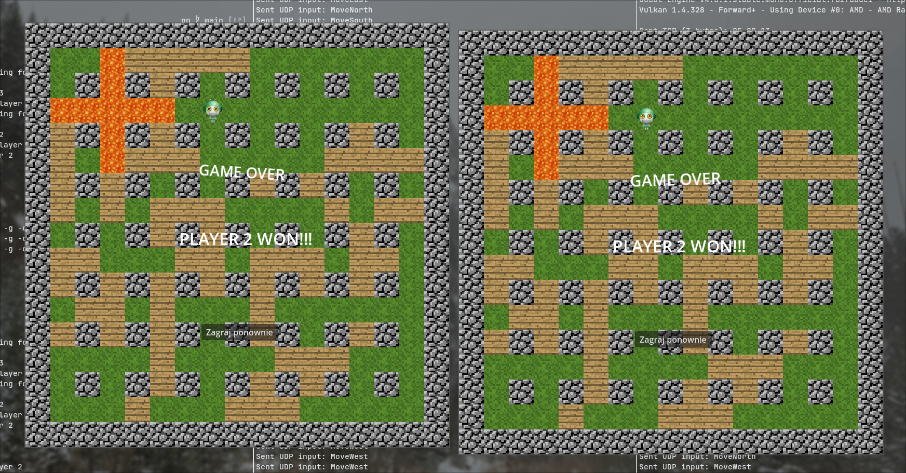

# LAN Bomberman (serwer C++, klient Godot/C#)

Maciej Kowalski 160251

Projekt to sieciowa gra silnie zainspirowana grą Bomberman. Składa się z serwera
napisanego w C++ oraz klienta w Godot (C#). Gra obsługuje od 2 do 4 graczy;
serwer rozstrzyga logikę gry.

## Architektura i sposób działania

- Model klient‑serwer: klienci wysyłają krótkie komendy po UDP, serwer co
  "tick" aktualizuje logikę gry i rozsyła pełny snapshot planszy po UDP do
  wszystkich klientów.
- Serwer przydziela identyfikatory graczy (1-4) podczas TCP‑owego procesu
  dołączania i odpowiada klientom odpowiednim `playerId`.
- Klient posiada konfigurowalny port UDP nasłuchu - dzięki temu kilku graczy
  może grać na tym samym komputerze (ten sam adres IP, różne porty), np. kilka
  klientów łączących się na `127.0.0.1` z innymi portami nasłuchu.

## Protokół sieciowy

Protokół opiera się na surowych `struct`ach "C-style".

Definicje protokołu znajdują się w:
- Serwer: `server/src/Protocol.h`
- Klient: `client/scripts/Protocol.cs`

Po dołączeniu do gry klient wysyła akcje gracza do serwera "zapakowe" w
`InputPacket`. Serwer przetwarza je, aktualizuje stan świata gry i rozsyła
wszystkim graczom `WorldStatePacket`.

```cpp
// fragment Protocol.h
enum class PacketType : uint8_t {
    ConnectResponse = 1,
    StartGame = 2,
    Input = 3,
    WorldState = 4,
    Join = 5,
    Restart = 6
};

enum class InputCommand : uint8_t {
    MoveNorth = 1,
    MoveSouth = 2,
    MoveWest = 3,
    MoveEast = 4,
    PlaceBomb = 5
};

// klienta -> serwer
struct InputPacket {
    PacketType type;
    uint8_t playerId;
    InputCommand cmd;
};

// serwer -> klienci
struct WorldStatePacket {
    PacketType type;
    TileState grid[GRID_SIZE];
    uint8_t winnerId; // 0 if no winner, 1-4 player, 5 draw
    uint8_t gameRunning;
};
```


```csharp
// fragment Protocol.cs
public enum PacketType: byte {
	ConnectResponse = 1,
	StartGame = 2,
	Input = 3,
	WorldState = 4,
	Join = 5,
	Restart = 6
};

public enum InputCommand: byte {
	MoveNorth = 1,
	MoveSouth = 2,
	MoveWest = 3,
	MoveEast = 4,
	PlaceBomb = 5
};

[StructLayout(LayoutKind.Sequential, Pack = 1)]
public struct InputPacket {
	public PacketType type;
	public byte playerId;
	public InputCommand cmd;
};

[StructLayout(LayoutKind.Sequential, Pack = 1)]
public unsafe struct WorldStatePacket {
	public PacketType type;
	public fixed byte grid[15 * 15];
	public byte winnerId; // 0 if no winner, 1-4 player, 5 draw
	public byte gameRunning;
	
	public TileState GetTile(int x, int y)
	{
		fixed (byte* ptr = grid)
		{
			return (TileState)ptr[y * 15 + x];
		}
	}
};
```

## Budowa i uruchomienie
Wymagania: `g++` (C++17), `make`, Godot skompilowany ze wsparciem dla C#.

Zbudowania serwera:
```bash
make -C server
```

Zbudowania klienta:
```bash
godot-mono --export-release "Linux"  --headless --path client
```

Uruchomienie serwera:
```bash
./server/bomberman_server
```

Uruchomienie klienta:
```bash
./client/SK2.x86_64
```

# Screenshoty

`




<!-- vi:spelllang=pl -->
